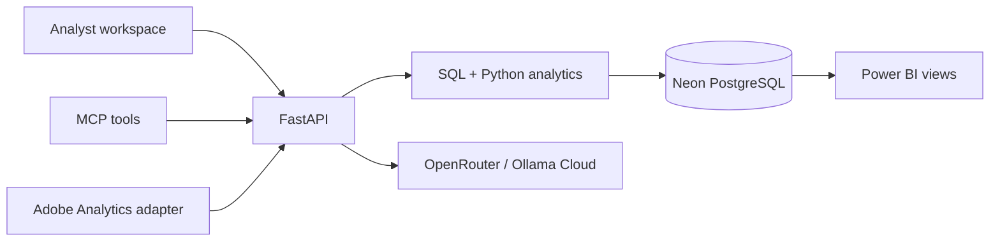

# TalentPulse · Product Analytics Lab

An independent portfolio project for product analysts in a European job marketplace. Observe a KPI, investigate the funnel, locate a segment, assess a release, evaluate an experiment, and turn evidence into a product recommendation.

[Open the live workspace](https://talentpulse-analytics.vercel.app) · [Source on GitHub](https://github.com/sohampatra3/talentpulse-analytics) · [Five-minute demo](docs/demo-walkthrough.md)

All historical marketplace behavior is **reproducible synthetic data**, not StepStone data. The simulated model arms illustrate an analytical method; their lift is not evidence that a real model improves a real marketplace. The live search comparison records actual provider calls separately.

## Stack and architecture

Next.js / React / TypeScript / Tailwind / Recharts → FastAPI / Pydantic → parameterized PostgreSQL + Python analytics → Neon. OpenRouter and Ollama Cloud interpret structured evidence and rerank a bounded shortlist of real database job IDs. Power BI connects directly to curated PostgreSQL views. Adobe Analytics has a provider boundary for credentials-backed REST reports. A read-only MCP endpoint exposes the same analytics services.



## Workspace

- **Overview:** KPIs, period comparison, daily trends, market and device performance.
- **Search experiments:** three-arm user-level analysis with confidence intervals, multiple-comparison correction, sample-ratio checks and operational guardrails; separate live manual/GPT-4o/GPT-OSS 120B comparison.
- **Funnel & segments:** ordered session funnel, transition drop-off, segmentation and consistent filters.
- **Release impact:** matched before/after windows and affected segments. Observational differences are hypotheses, not causal estimates.
- **AI analyst:** evidence-backed interpretation, a chart draft using queried numbers, and an exportable recommendation.
- **Data & connections:** quality checks, tracking dictionary, Neon, OpenRouter, Ollama, Adobe and Power BI setup.

Light and dark themes are available. The application clearly distinguishes connected, unconfigured, failed and simulated states.

## Run locally

Requires Node.js 22+ and Python 3.12+.

```bash
npm ci
python3 -m venv .venv
.venv/bin/pip install -r requirements.txt
cp .env.example .env
# Set the database and provider credentials in .env.
.venv/bin/python scripts/seed.py
.venv/bin/uvicorn api.index:app --host 127.0.0.1 --port 8000
# In a second terminal:
npm run dev
```

Open http://localhost:3000. FastAPI OpenAPI documentation is available at the configured docs route. Analytics stay in Python; React formats and renders API results.

## Database and reproducibility

`database/schema.sql` owns the `talentpulse` schema. The generator seeds a fixed eight-week window ending 4 October 2026, with 50,000 users, 100,000 jobs, 350,000 sessions and 2,510,875 ordered product events. It injects modeled mobile upload failures, new-user friction, market differences, a temporary release regression and a recommendation treatment effect. The UI discovers these patterns through queries.

The seed skips an already completed dataset. It commits bounded batches to support small Neon compute instances and writes its completion manifest after reconciliation. An interrupted initial load must be explicitly rebuilt with `--reset`. That reset affects only this application's schema; never point a reset at an unrelated production database. Use a direct Neon connection for migrations and seeding and a pooled connection for serverless requests.

Read [analytical methodology](docs/methodology.md), [demonstration walkthrough](docs/demo-walkthrough.md), [Power BI setup](powerbi/README.md), and the backend API contract for metric definitions and practical limitations.

## Providers and credentials

- OpenRouter: `OPENROUTER_API_KEY`, default `OPENROUTER_MODEL=openai/gpt-4o`.
- Ollama Cloud: `OLLAMA_API_KEY`, default `OLLAMA_MODEL=gpt-oss:120b`. No local model download is required.
- Power BI: native PostgreSQL connection plus your Microsoft account and workspace. Optional `POWERBI_EMBED_URL` enables an existing report.
- Adobe Analytics: your organization's OAuth credentials and report suite, when available. Synthetic Neon data works independently.

Keys are server-only. Never commit `.env`, put keys in `NEXT_PUBLIC_*`, paste keys into the browser, or include credentials in exported reports. Missing provider credentials leave the evidence mode and SQL analytics available. Public demo AI usage is bounded; it is not an unrestricted provider proxy.

## Verify

```bash
npm run typecheck
npm run build
.venv/bin/python -m pytest tests -q
```

Tests cover important statistical and analytical boundaries. End-to-end validation also checks the real database, API contracts, UI filters, provider statuses and deployment routes.

Run `.venv/bin/python scripts/verify_dataset.py` to reconcile counts, funnel ordering, event attribution, experiment timing and binary user outcomes against the seed manifest. The verifier writes a local result under the ignored `artifacts` directory.

## Deploy

The repository includes Vercel configuration for Next.js and a Python FastAPI function. Configure encrypted environment variables before production deployment. The database is independently managed by Neon in Frankfurt. GitHub contains source and reproducibility instructions, not database passwords or provider credentials.

This lab is independent of and not endorsed by StepStone. It demonstrates SQL, Python, tracking design, product KPIs, funnel analysis, segmentation, release assessment, experiment statistics and grounded AI communication. It does not claim to describe internal StepStone systems or known company problems.
